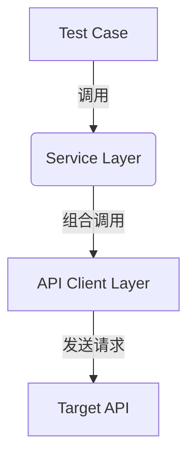

# Skill: Lounger 框架 API 自动化分层设计实战

## 核心理念 (Core Philosophy)

**以测试为中心 (Test-Centric)**：摒弃脚本式调用，采用面向对象与分层架构思想。

- **单接口**：语义化门面模式 (Facade Pattern)，隐藏 HTTP 细节
- **多接口**：业务服务层 (Service Layer)，编排复杂流程，实现高复用
- **目标**：提升代码可读性、可维护性，降低用例维护成本

---

## 架构分层 (Architecture Layers)

采用经典的三层架构解耦测试逻辑：

| 层级 | 名称 | 职责 | 关键词 |
|------|------|------|--------|
| **L1** | Test Case (测试用例层) | 描述"做什么"(业务验证)，只关注断言和业务数据 | pytest, assert, BDD |
| **L2** | Service (业务服务层) | 描述"怎么做"(流程编排)，组合多个 API 完成业务场景 | Flow, Orchestration, Reuse |
| **L3** | Client (API 客户端层) | 描述"怎么调"(HTTP 封装)，单个接口的语义化映射 | HttpRequest, Facade, Semantic |



---

## 实施规范 (Implementation Standards)

### 3.1 L3: API 客户端层 (Single Interface Facade)

**原则**：一个接口对应一个具名方法，方法名即业务含义。

**核心要点**：
- **基类继承**：所有 API 类继承 `lounger.request.HttpRequest`
- **配置管理**：base_url, headers, auth 等在 `__init__` 中统一初始化
- **类型提示**：参数必须添加 Type Hints，提升 IDE 智能提示体验
- **文档字符串**：简洁说明业务语义，可选包含 Args/Returns

**真实项目示例** (`api/clients/email_api.py`)：

```python
from lounger.request import HttpRequest
from lounger.request import api


class EmailAPI(HttpRequest):
    """邮件 API 客户端"""

    def __init__(self, base_url: str, token: str):
        super().__init__(base_url=base_url)
        self.token = token

    @api(describe="更新邮件活动")
    def update_campaign(self, campaign_data: dict):
        """更新邮件活动"""
        api_path = "/api/{service}/v1/{action}"
        headers = {
            "Authorization": f"Bearer {self.token}",
        }
        r = self.post(api_path, json=campaign_data, headers=headers)
        return r

    @api(describe="获取对比邮件活动详情")
    def get_contrast_campaigns_detail(self, params: dict):
        """
        【业务语义】获取对比邮件活动的详细信息
        
        Args:
            params: 查询参数，包含 ccId, langCode 等
            
        Returns:
            API 响应对象，包含对比邮件活动的详情数据
        """
        api_path = "/api/{service}/v1/{action_name}"
        headers = {
            "Authorization": f"Bearer {self.token}",
            "Content-Type": "application/json",
        }
        r = self.post(api_path, json=params, headers=headers)
        return r

    @api(describe="获取商店邮件设置")
    def get_shop_email_setting(self):
        """
        【业务语义】获取商店的邮件配置信息（无需参数）
        
        Returns:
            API 响应对象，包含商店邮件设置详情
        """
        api_path = "/api/{service}/v1/{action_name}"
        headers = {
            "Authorization": f"Bearer {self.token}",
            "Content-Type": "application/json",
        }
        r = self.get(api_path, json={}, headers=headers)
        return r
```

**关键特性**：
- ✅ 使用 `@api` 装饰器标记方法
- ✅ 方法名即业务语义（如 `update_campaign`, `get_contrast_campaigns_detail`）
- ✅ 灵活的参数设计：使用 `dict` 传递完整参数，支持正常和异常场景测试
- ✅ GET/POST 方法根据实际接口需求选择
- ✅ Headers 在方法内定义，支持自定义 Header（如 `x-xxx-fromtype`）

---

### 3.2 L2: 业务服务层 (Business Service Orchestration)

**原则**：封装跨接口的业务逻辑，对测试用例屏蔽中间步骤（如登录、鉴权）。

**核心要点**：
- **依赖注入**：在 `__init__` 中接收所需的 Client 实例
- **流程黑盒**：测试用例只需调用 `service.place_order()`，无需关心内部调用了 login 或 create_user
- **数据传递**：自动处理接口间的依赖数据（如将 Login 返回的 token 传递给 Order API）

**适用场景**：
- ✅ 多接口串联的业务流程（如：创建用户 → 登录 → 下单）
- ✅ 需要前置条件的测试（如：先创建数据再查询）
- ✅ 复杂的业务场景封装

**注**：当前项目以单接口功能测试为主，Service 层可根据实际需求后续补充。

---

### 3.3 L1: 测试用例层 (Test Cases)

**原则**：极度简洁，仅包含测试数据和断言。

**核心要点**：
- **Fixture 驱动**：利用 `conftest.py` 管理 Client 和 Service 的生命周期与初始化
- **断言标准化**：使用 `pytest_req.assertions.expect` 进行链式断言
- **数据驱动**：复杂数据使用 JSON 文件管理，简单参数直接在代码中定义

**真实项目示例** (`test_dir/email_case/test_update_campaign.py`)：

```python
import pytest
from pytest_req.assertions import expect
from lounger.utils.resource_loader import resource_file


@pytest.fixture(scope="module")
def params():
    return resource_file("campaign_data.json")


def test_update_campaign(email_api, params):
    """验证更新邮件活动"""
    s = email_api.update_campaign(params)
    expect(s).to_have_path_value("msg", "success")
```

**简单参数内联示例** (`test_dir/email_case/test_get_contrast_campaigns_detail.py`)：

```python
import pytest
from pytest_req.assertions import expect


def test_get_contrast_campaigns_detail(email_api):
    """验证获取对比邮件活动详情（正常场景）"""
    params = {
        "ccId": 1234,
        "langCode": None
    }
    s = email_api.get_contrast_campaigns_detail(params)

    # 断言响应成功
    expect(s).to_have_path_value("msg", "success")
```

**Fixture 配置示例** (`test_dir/conftest.py`)：

```python
import pytest
from api.clients.email_api import EmailAPI
from api.clients.shop_api import ShopAPI


@pytest.fixture(scope="session")
def env_config():
    config = {
        # 测试环境（示例，用于演示；请在实际项目中通过安全方式管理）
        "develop": {
            "base_url": "https://api.example.test",
            "token": "REDACTED_TOKEN"
        }
    }
    return config["develop"]


@pytest.fixture()
def email_api(env_config):
    """邮件 API 客户端 fixture"""
    return EmailAPI(env_config["base_url"], env_config["token"])


@pytest.fixture()
def shop_api(env_config):
    """商店 API 客户端 fixture"""
    return ShopAPI(env_config["base_url"], env_config["token"])
```

---

## 项目目录结构 (Project Structure)

**真实项目的标准工程结构**：

```shell
project_root/
├── config/                     # 环境配置 (dev, prod)
├── api/
│   ├── clients/                # [L3] API 客户端
│   │   ├── __init__.py
│   │   ├── email_api.py        # 邮件 API (4 个方法)
│   │   └── shop_api.py         # 商店 API (4 个方法)
│   └── services/               # [L2] 业务服务 (可选)
│       ├── __init__.py
│       └── order_flow.py
├── test_dir/
│   ├── conftest.py             # 全局 Fixture 定义
│   ├── email_case/             # 邮件测试用例目录
│   │   ├── test_update_campaign.py
│   │   ├── test_get_contrast_campaigns_detail.py
│   │   ├── test_get_email_campaign_tpl_list.py
│   │   └── test_get_shop_email_setting.py
│   ├── shop_case/              # 商店测试用例目录
│   │   ├── test_get_user_info.py
│   │   ├── test_get_shop_config.py
│   │   ├── test_get_guide_steps.py
│   │   └── test_get_adv_config.py
│   └── test_data/              # 测试数据文件
│       ├── campaign_data.json
│       ├── rule_data.json
│       └── ...
├── logs/                       # 日志目录
├── reports/                    # 测试报告目录
├── conftest.py                 # 根目录 Fixture
├── pytest.ini                  # Pytest 配置
├── requirements.txt
└── SKILL.md                    # 本规范文档
```

---

## 关键决策矩阵 (Decision Matrix)

| 场景 | 推荐方案 | 理由 |
|------|----------|------|
| 单接口功能测试 | 直接调用 API Client | 简单直接，无需过度抽象 |
| 多接口业务场景 | 必须使用 Service Layer | 避免用例冗余，集中管理流程逻辑 |
| 临时探索/调试 | 直接使用 requests / lounger | 快速验证，无需写入工程文件 |
| 第三方 API 集成 | 封装为 Client + Service | 隔离外部依赖变化，便于 Mock |
| 参数复杂度 < 5 字段 | 参数内联到测试代码 | 减少文件切换，代码更直观 |
| 参数复杂度 ≥ 5 字段 | 使用 JSON 文件管理 | 数据与代码分离，易于维护 |

---

## ⚠️ 避坑指南

**禁止事项**：
- ❌ 禁止在测试用例 (`test_*.py`) 中直接写 `post/get` 请求代码
- ❌ 禁止在 Service 层硬编码具体的 URL 路径（应由 Client 层管理）
- ❌ 避免过度设计：若某流程仅在一个用例中使用且无复用可能，可暂不提取为 Service
- ❌ 不要擅自修改已有代码的注释和实现
- ❌ 不要在每个测试文件中重复定义 fixture（应在全局 conftest.py 中定义）

**最佳实践**：
- ✅ 已有代码零修改：添加新功能时，只新增文件和方法，不改动已有代码
- ✅ 灵活参数设计：使用 `dict` 传递参数，支持测试各种正常和异常场景
- ✅ 数据驱动：测试数据与代码分离，复杂数据使用 JSON 文件
- ✅ 复用 fixture：在全局 conftest.py 中统一定义 fixture
- ✅ 简洁 docstring：方法注释保持简洁，一行说明业务语义即可

---

## 核心价值总结 (Key Takeaways)

### 可读性 (Readability)
- `email_api.update_campaign(data)` 优于 `post("/v1/order", ...)`
- 用例即文档：方法名清晰表达业务意图

### 可维护性 (Maintainability)
- 接口变更只需修改 Client 层
- 流程变更只需修改 Service 层
- 用例层零修改

### 复用性 (Reusability)
- 复杂的业务流程封装一次，可在正向、异常、性能测试中重复调用
- Fixture 统一管理，避免重复代码

### 工程化 (Engineering)
- 符合单一职责原则 (SRP) 和开闭原则 (OCP)
- 适合中大型自动化测试体系建设
- 支持持续集成和自动化部署

---

## 参考框架

- **Lounger**: 测试框架基础
- **Pytest**: 测试运行器和断言
- **Requests**: HTTP 请求底层支持

**适用技术栈**：Python, Pytest, Lounger, Requests

---

## 附录：完整示例

### A.1 完整的测试流程

1. **定义 API Client** (`api/clients/email_api.py`):
   ```python
   class EmailAPI(HttpRequest):
       @api(describe="更新邮件活动")
       def update_campaign(self, campaign_data: dict):
           # 使用占位路径示例，真实项目请替换为具体服务路径
           api_path = "/api/{service}/v1/{action}"
           headers = {"Authorization": f"Bearer {self.token}"}
           return self.post(api_path, json=campaign_data, headers=headers)
   ```

2. **配置 Fixture** (`test_dir/conftest.py`):
   ```python
   @pytest.fixture()
   def email_api(env_config):
       return EmailAPI(env_config["base_url"], env_config["token"])
   ```

3. **编写测试用例** (`test_dir/email_case/test_update_campaign.py`):
   ```python
   def test_update_campaign(email_api, params):
       s = email_api.update_campaign(params)
       expect(s).to_have_path_value("msg", "success")
   ```

4. **准备测试数据** (`test_dir/test_data/campaign_data.json`):
   ```json
    {
        "campaignId": "campaign_001",
        "campaignName": "Example Campaign",
        "status": "active"
    }
   ```

### A.2 运行测试

```bash
# 运行单个测试文件
pytest test_dir/email_case/test_update_campaign.py -v

# 运行所有 email_case 测试
pytest test_dir/email_case/ -v

# 运行特定测试用例
pytest test_dir/email_case/test_update_campaign.py::test_update_campaign -v

# 生成测试报告
pytest test_dir/email_case/ -v --html=reports/report.html
```

---

**版本**: v2.0  
**更新日期**: 2024-03-20
**基于项目**: example-api-testing (示例项目实践)
