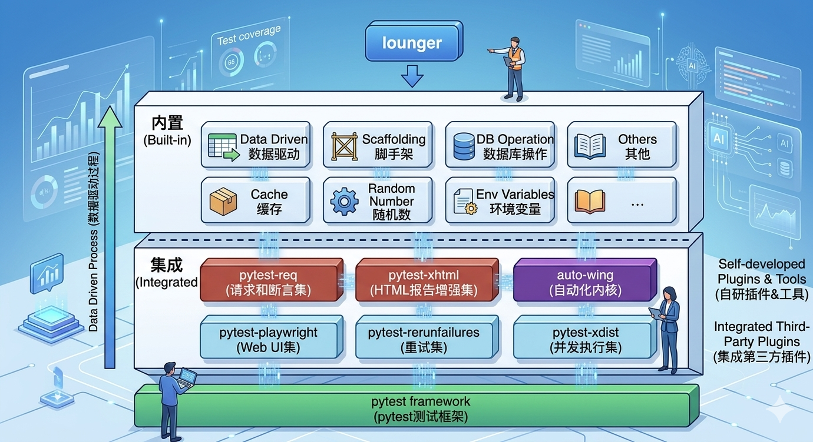
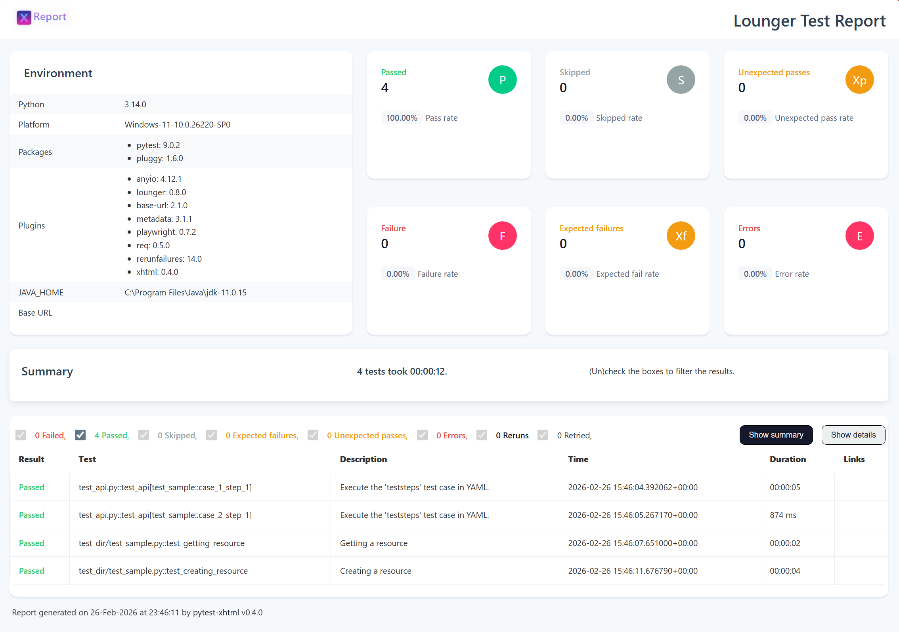
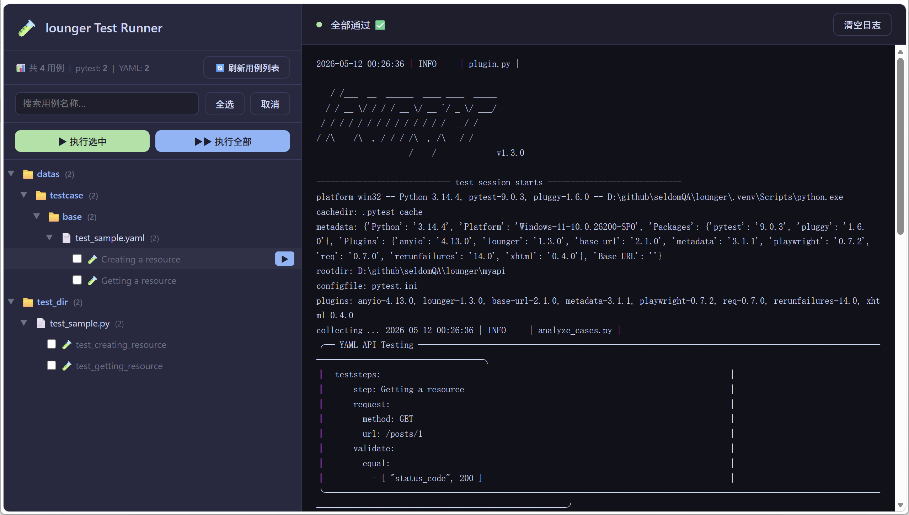

# lounger

Next generation automated testing framework. Supports API, Web, and AI automated testing.

> 下一代自动化测试框架 —— 支持 API、Web 与 AI 自动化测试。

`Lounger` 是一个基于 `pytest` 构建的高集成度自动化测试框架。它不仅简化了传统的 API 和 Web UI 自动化流程，还通过内置的 AI
能力与工程化脚手架，帮助开发者与测试工程师快速构建稳定、可扩展的测试套件。

---

## ✨ 核心特性

* **🛠️ 开箱即用的脚手架**: 通过 `lounger` 命令行工具快速初始化项目结构，支持 API 或 Web 模版。
* **🌐 统一的生态集成**: 深度整合 `pytest-playwright`、`pytest-req`、`pytest-xhtml` 等插件，一套代码覆盖多种测试场景。
* **🤖 AI 驱动测试**: 支持集成 AI Agent 能力，探索“动词式”自动化，降低 UI 变更带来的维护成本。
* **📊 增强型报告**: 内置定制化 HTML 测试报告，提供详尽的执行日志、截图与断言信息。
* **⚡ 性能与并发**: 原生支持 `pytest-xdist`，轻松实现测试用例的并发执行。
* **💾 数据驱动与缓存**: 内置数据驱动支持（YAML/JSON）以及跨用例的缓存管理机制。

---

## 🏗️ 框架架构

项目采用分层架构设计，确保了底层驱动的稳定性与上层业务的灵活性：

1. **内置核心 (Built-in)**: 脚手架、数据驱动引擎、数据库操作工具、环境变量管理。
2. **集成层 (Integrated)**:

* **自研插件**: `pytest-req` (API), `pytest-xhtml` (Report), `auto-wing` (Engine).
* **三方插件**: Playwright, RerunFailures, Xdist.


3. **驱动层 (Engine)**: 基于成熟的 `pytest` 测试框架。



---

## 🚀 快速开始

### 安装

* 安装 lounger

```bash
pip install lounger

```

* 查看`lounger` 命令

```bash
lounger --help
Usage: lounger [OPTIONS] COMMAND [ARGS]...

  lounger — next generation automated testing framework.

  Examples:
    lounger --project-web myproject
    lounger --project-api myproject
    lounger runner --port 5002 --project ./myapi

Options:
  --version                Show version.
  -pw, --project-web TEXT  Create a Web automation test project.
  -pa, --project-api TEXT  Create an API automation test project.
  --help                   Show this message and exit.

Commands:
  runner  Start the web test runner.
```


### 创建新项目

使用脚手架快速生成项目目录：

```bash
# 创建 Web UI 自动化项目
lounger --project-web myweb

# 创建 API 自动化项目
lounger --project-api myapi

```

### 运行测试

```bash
# 进入项目目录
cd myapi

# 运行所有用例并生成报告
pytest
```



## 🧪 web运行器

定制化测试运行器，更加方便的管理和运行测试用例。

```bash
lounger runner --port 5001

🚀 lounger web runner → http://127.0.0.0:5001
   Project: D:\github\seldomQA\lounger\myapi
   Press Ctrl+C to stop.
```

浏览器访问：http://127.0.0.0:5001



---

## 项目&文档&示例

1. 如何进行Web自动化测试？👉 [阅读文档](./myweb)
2. 如何进行API自动化测试？👉 [阅读文档](./myapi)
3. 框架集成了哪些功能？ [测试示例](./tests)

---

## 🤝 贡献与反馈

如果你在使用过程中有任何建议或发现了
Bug，欢迎提交 [Issue](https://github.com/SeldomQA/lounger/issues) 或 Pull Request。

---
