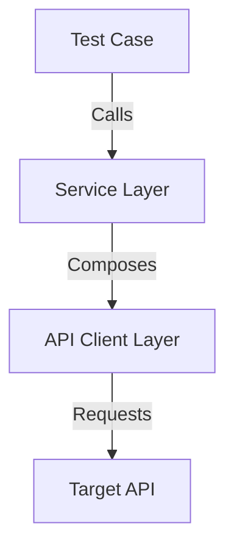

# Skill: Layered API Automation Design with the Lounger Framework

## Core Philosophy

**Test-Centric Design**: Move away from script-style request calls and adopt object-oriented, layered test architecture.

- **Single API**: Use a semantic facade pattern to hide raw HTTP details.
- **Multiple APIs**: Use a service layer to orchestrate business flows and improve reuse.
- **Goal**: Improve readability and maintainability while reducing long-term case maintenance cost.

---

## Architecture Layers

Use a classic three-layer structure to separate responsibilities:

| Layer | Name | Responsibility | Keywords |
|------|------|------|--------|
| **L1** | Test Case | Describes "what to verify" and focuses on assertions plus business data | pytest, assert, BDD |
| **L2** | Service | Describes "how the flow works" and composes multiple APIs into one business scenario | Flow, Orchestration, Reuse |
| **L3** | Client | Describes "how to call the API" and wraps a single endpoint with semantic methods | HttpRequest, Facade, Semantic |



---

## Implementation Standards

### 3.1 L3: API Client Layer

**Principle**: One endpoint should map to one clearly named method, and the method name should express business intent.

**Key rules**:
- Inherit every API client from `lounger.request.HttpRequest`.
- Initialize shared settings such as `base_url`, headers, and auth in `__init__`.
- Add type hints to method parameters.
- Keep docstrings short and focused on business meaning.

**Example**:

```python
from lounger.request import HttpRequest
from lounger.request import api


class EmailAPI(HttpRequest):
    """Email API client."""

    def __init__(self, base_url: str, token: str):
        super().__init__(base_url=base_url)
        self.token = token

    @api(describe="Update an email campaign")
    def update_campaign(self, campaign_data: dict):
        """Update an email campaign."""
        api_path = "/api/{service}/v1/{action}"
        headers = {
            "Authorization": f"Bearer {self.token}",
        }
        return self.post(api_path, json=campaign_data, headers=headers)

    @api(describe="Get contrast campaign details")
    def get_contrast_campaigns_detail(self, params: dict):
        """Get details for contrast campaigns."""
        api_path = "/api/{service}/v1/{action_name}"
        headers = {
            "Authorization": f"Bearer {self.token}",
            "Content-Type": "application/json",
        }
        return self.post(api_path, json=params, headers=headers)
```

**Characteristics**:
- Use the `@api` decorator to mark client methods.
- Let method names carry the business meaning.
- Pass flexible request data with `dict` to support both normal and negative scenarios.
- Choose GET or POST based on the endpoint contract.
- Define request headers inside the method when the API needs custom headers.

### 3.2 L2: Business Service Layer

**Principle**: Encapsulate cross-endpoint business logic and hide intermediate steps from test cases.

**Key rules**:
- Inject dependent client instances through `__init__`.
- Keep flows as black boxes so the test only calls one business action.
- Pass dependent data between endpoints automatically, such as propagating a login token.

**Recommended for**:
- Multi-endpoint flows such as create user -> login -> place order
- Tests that need setup steps before the real verification
- Reusable and complex business scenarios

**Note**: If your project mainly tests single endpoints, you can add the service layer later when it becomes useful.

### 3.3 L1: Test Case Layer

**Principle**: Keep test files extremely small and focused on data plus assertions.

**Key rules**:
- Use fixtures in `conftest.py` to manage client and service initialization.
- Standardize assertions with `pytest_req.assertions.expect`.
- Put complex data into JSON files and keep simple parameters inline.

**Example**:

```python
import pytest
from pytest_req.assertions import expect
from lounger.utils.resource_loader import resource_file


@pytest.fixture(scope="module")
def payload():
    return resource_file("campaign_data.json")


def test_update_campaign(email_api, payload):
    """Verify campaign update."""
    response = email_api.update_campaign(payload)
    expect(response).to_have_path_value("msg", "success")
```

---

## Project Structure

```shell
project_root/
├── config/
├── api/
│   ├── clients/
│   │   ├── __init__.py
│   │   └── posts_api.py
│   └── services/
│       └── __init__.py
├── test_dir/
│   ├── conftest.py
│   ├── posts_case/
│   │   ├── test_create_post.py
│   │   └── test_get_post.py
│   └── test_data/
│       └── create_post_payload.json
├── reports/
├── conftest.py
├── pytest.ini
└── SKILL.md
```

---

## Decision Matrix

| Scenario | Recommended Approach | Why |
|------|------|------|
| Single-endpoint functional test | Call the API client directly | Simple and direct |
| Multi-endpoint business flow | Use a service layer | Avoid duplicated flow logic |
| Temporary exploration or debugging | Use raw requests or Lounger directly | Faster validation |
| Third-party API integration | Wrap it with client + service | Isolate external changes |
| Fewer than 5 input fields | Keep parameters inline in the test | Easier to read |
| 5 or more input fields | Store data in JSON | Better separation of data and code |

---

## Pitfalls To Avoid

**Do not**:
- Write raw `get()` or `post()` calls directly inside `test_*.py` files.
- Hardcode endpoint URLs inside the service layer.
- Over-design one-off flows with no reuse value.
- Duplicate fixtures in each test file.

**Best practices**:
- Add new files and methods instead of rewriting existing code whenever possible.
- Use `dict` payloads for flexible positive and negative testing.
- Keep test data separate from code when the payload becomes complex.
- Reuse shared fixtures from a central `conftest.py`.
- Keep docstrings short and meaningful.

---

## Key Takeaways

### Readability
- `posts_api.create_post(data)` is clearer than `post("/posts", ...)`.
- Good method names turn tests into readable documentation.

### Maintainability
- Endpoint changes belong in the client layer only.
- Flow changes belong in the service layer only.
- Test files can stay untouched.

### Reusability
- A business flow can be reused across happy-path, negative, and performance scenarios.
- Shared fixtures reduce duplicate setup logic.

### Engineering Quality
- The structure follows SRP and OCP.
- It scales better for medium and large automation projects.
- It works well with CI pipelines and automated delivery.

---

## Example Workflow

1. Define an API client in `api/clients/posts_api.py`.
2. Register fixtures in `test_dir/conftest.py`.
3. Write focused test cases under `test_dir/posts_case/`.
4. Store reusable payloads in `test_dir/test_data/`.

---

## Run Tests

```bash
# Run one file
pytest test_dir/posts_case/test_get_post.py -v

# Run the whole posts case folder
pytest test_dir/posts_case/ -v

# Run one test case
pytest test_dir/posts_case/test_create_post.py::test_create_post -v

# Generate a report
pytest test_dir/posts_case/ -v --html=reports/report.html
```

---

**Version**: v2.0
**Updated**: 2024-03-20
