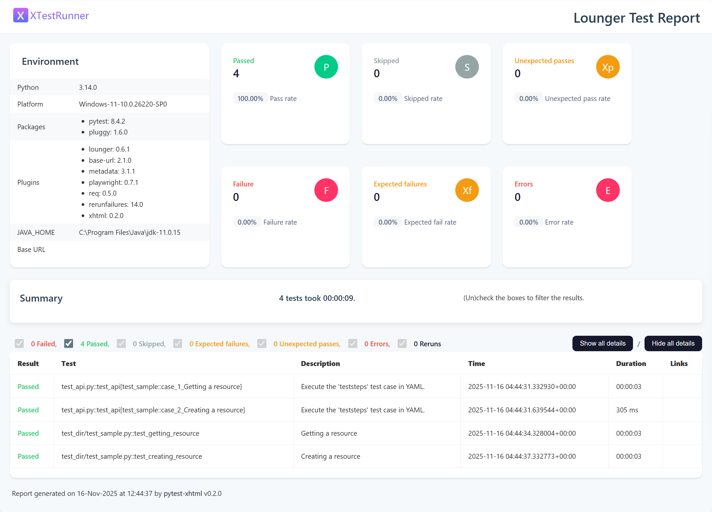
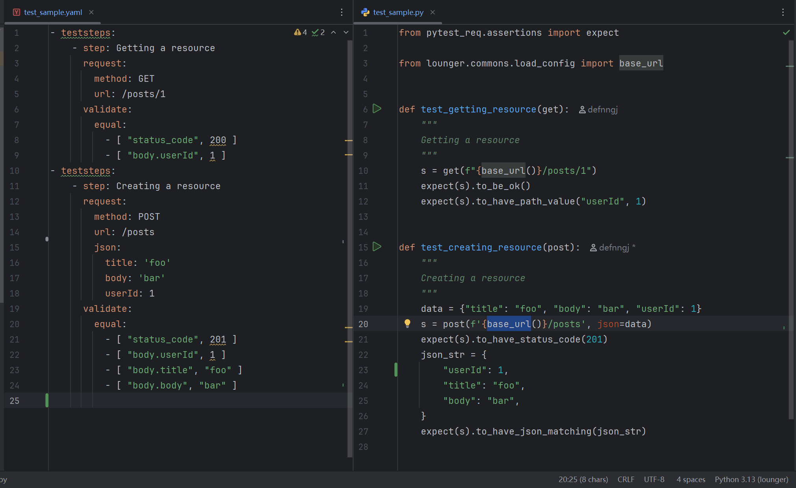

# lounger框架兼容YAML管理API测试

## 安装与使用

### 安装

* 支持pip安装

```shell
pip install lounger
```

### 脚手架

lounger 支持命令生成API测试项目。

```shell
lounger --project-api myapi
2025-11-16 17:58:18 | INFO     | cli.py | Start to create new test project: myapi
2025-11-16 17:58:18 | INFO     | cli.py | CWD: D:\github\seldomQA\lounger

2025-11-16 17:58:18 | INFO     | cli.py | 📁 created folder: reports
2025-11-16 17:58:18 | INFO     | cli.py | 📄 created file: conftest.py
2025-11-16 17:58:18 | INFO     | cli.py | 📄 created file: pytest.ini
2025-11-16 17:58:18 | INFO     | cli.py | 📄 created file: test_api.py
2025-11-16 17:58:18 | INFO     | cli.py | 📄 created file: config/config.yaml
2025-11-16 17:58:18 | INFO     | cli.py | 📄 created file: datas/sample/test_sample.yaml
2025-11-16 17:58:18 | INFO     | cli.py | 📄 created file: test_dir/__init__.py
2025-11-16 17:58:18 | INFO     | cli.py | 📄 created file: test_dir/test_sample.py
2025-11-16 17:58:18 | INFO     | cli.py | 🎉 Project 'myapi' created successfully.
2025-11-16 17:58:18 | INFO     | cli.py | 👉 Go to the project folder and run 'pytest' to start testing.
```

* 目录结构如下

```shell
├─config
│  ├─config.yaml
├─datas    # 用YAML写用例
│  ├─sample
│  │   ├─test_sample.yaml
├─test_dir # 用code写用例
│  ├─test_sample.py
├─reports
├─conftest.py
├─pytest.ini
└─test_api.py
```

### 运行测试

* 进入项目，运行测试。

```shell
cd myapi
pytest
```

* 测试报告
  

## 基础概念

### 设计原则

**约定大于配置：**

pytest 对于这一设计理念体现的比较明显。

| 功能         | 约定（Convention）            | 若不遵守 → 需要配置？           |
|------------|---------------------------|------------------------|
| 测试文件       | `test_*.py` 或 `*_test.py` | 需用 `-k`、`--ignore` 等参数 |
| 测试函数/方法    | 名称以 `test_` 开头            | 不会被收集                  |
| Fixture 注入 | 参数名 = fixture 名           | 无法自动注入                 |
| 共享配置       | 放在 `conftest.py`          | 需手动 `import` 或配置路径     |

**高内聚低耦合。**

* 高内聚：指一个模块内部各个元素之间的联系紧密，功能单一明确。高内聚的模块只负责一项任务，能够提高代码的可重用性和可理解性。
* 低耦合：指模块之间的依赖关系尽可能少，模块之间相对独立。低耦合的设计使得一个模块的变化不会影响到其他模块，从而提高系统的灵活性和可维护性。

**简化配置：**

* 为什么选择集成`pytest-xhtml`报告，最重要的原因就是`pytest-xhtml`更加简单，虽然`allure-pytest`
  提供了更丰富的功能，但是，安装配置和具体的使用都更加复杂。
* `pytest-xhtml`基于`pytest-html`的二次开发，已经提供了更加现代的设计风格，打印日志足够详细，使用方式与`pytest-html`
  保持一致，直接跟`--html=xx.html`参数即可。

## YAML编写规范

#### 用例查找规范

1. config/config.py 必须配置项目目录。

    ```yaml
    test_project:
      sample: True # 查找该目录下的测试用例（文件）
    ```

2. 测试文件名遵循 test_xxx.yaml或 xxx_test.yaml 。

    ```shell
    ├── datas
    │ └── sample
    │ │ ├── login.yaml # 不是用例
    │ │ ├── get_resource_test.yaml # 是用例
    │ └── test_get_resource.yaml # 是用例
    ```

### 一个测试用例包含多步骤

不管是功能用例还是接口用例，一个用例允许包含N个接口步骤。所以，一个接口可以是一条用例，一条用例可能包含多个接口。

```yaml
- teststeps:
    - presteps:  # 前置步骤
      ...
    - name:      # 测试步骤
      ...
    - name:      # 测试步骤
      ...
    - name:      # 测试步骤
      ...
```

### 一个步骤核心要素

```yaml
- teststeps:
    - name:      # 步骤名
      request:   # 请求
      extract:   # 变量提取
      validate:  # 断言
      sleep: 5 # 等待时间
```

### 一个 HTTP请求参数

```yaml
- teststeps:
    - name:      # 步骤名
      requests: # 请求
        method:  # 请求方法，如 'GET', 'POST' 等
        url:  # 请求地址（URL）
        params:  # (可选) 字典或字节流，用于添加查询参数（query string）
        data:  # (可选) 字典、元组列表、字节或文件对象，作为请求体发送
        headers:  # (可选) HTTP 请求头字典
        cookies:  # (可选) 字典或 CookieJar 对象，随请求发送
        files:  # (可选) 文件字典，用于上传文件（multipart/form-data）
        auth:  # (可选) 认证元组或可调用对象，用于 Basic/Digest/自定义认证
        timeout:  # (可选) 超时时间，单位为秒（可为浮点数或 (连接, 读取) 元组）
        allow_redirects:  # (可选) 是否允许重定向，默认为 True
        proxies:  # (可选) 代理配置字典，指定协议或主机对应的代理地址
        hooks:  # (可选) 钩子函数字典，如请求前后执行的回调
        stream:  # (可选) 是否延迟下载响应内容，默认为 False（立即下载）
        verify:  # (可选) 是否验证服务器 TLS 证书；True/False 或 CA 证书路径
        cert:  # (可选) SSL 客户端证书路径，或 ('证书文件', '密钥文件') 元组
        json:  # (可选) Json 格式数据。
```

### 接口断言方法

```yaml
- teststeps:
    - name: get user info
      request:
      validate: # 断言
        equal: # 断言相等
          - [ "status_code", 200 ]
          - [ "body.code", 10200 ]
        not_equal: # 断言不相等
          - [ "body.data.name", "jack" ]
        contains: # 断言包含
          - [ "body.message", "succ" ]
        not_contains: # 断言不包含
          - [ "body.message", "access" ]
        "length": # 断言长度
          - [ "body.body", 158 ]
        "greater": # 大于
          - [ "body.id", 0 ]
        "greater_equal": # 大于等于
          - [ "body.id", 1 ]
        "less": # 小于
          - [ "body.id", 2 ]
        "less_equal": # 小于等于
          - [ "body.id", 1 ] 
```

## 主运行文件

> 既然要实现YAML管理测试用例，为什么还要提供这么个代码文件，其实所谓无代码，只是利用了pytest的参数化，测试用例通过YAML数据文件描述，最终交给
`@pytest.mark.parametrize()` 解析，然后，交由pytest运行。
> 在`pytest`看来，这就是一个使用参数化的测试用例。此外，这里相当于留了个口子，如果不懂代码，只运行这个文件就完了，如果有兴趣一探究竟，可以研究
`@load_teststeps()`装饰器是如何识别和加载用例的，`execute_teststeps()`又是如何执行用例的。

* 运行测试入口文件：`test_api.py`

```python
# test_api.py
from typing import Dict

from lounger.analyze_cases import load_teststeps
from lounger.case import execute_teststeps


@load_teststeps()
def test_api(teststeps: Dict) -> None:
    """
    Execute the 'teststeps' test case in YAML.
    """
    execute_teststeps(teststeps)
```

**为什么不设计成一个命令来运行YAML文件？例如 `lounger -r datas/sample/test_sample.yaml`**

存在两个问题：

1. 命令行工具不适合运行大型自动化项目，例如，全局前置/后置依赖。
2. 无法兼容，测试项目中一部分是 code 用例，一部分是 YAML 用例。

相反，使用 `pytest` 命令执行就非常灵活了，完全兼容`pytest`生态。

## 更多功能支持

### 变量提取&引用

在场景测试中，我们往往需要将A接口的返回值提取出来，作为B接口的参数。

```yaml
- teststeps:
    - name: Listing all resources
      request:
        method: GET
        url: /posts
      extract:
        second_id: "[1].id"  # 提取变量
      validate:
        equal:
          - [ "status_code", 200 ]
    - name: Getting a resource
      request:
        method: GET
        url: /posts/${extract(second_id)}  # 使用提取变量
      validate:
        equal:
          - [ "status_code", 200 ]
```

### 全局测试变量

在配置文件`config/config.yaml`配置全局测试变量。

```yaml

global_test_config:
  var_one: foo
  var_two: bar
```

在测试用例中使用global_test_config全局测试变量。

```yaml
- teststeps:
    - name: Creating a resource
      request:
        method: POST
        url: /posts
        headers:
          Content-Type: application/json; charset=UTF-8
        json:
          title: '${config(var_one)}'  # 使用全局测试变量
          body: '${config(var_two)}'   # 使用全局测试变量
          userId: 1
      validate:
        equal:
          - [ "status_code", 201 ]
          - [ "body.userId", 1 ]
          - [ "body.title", "foo" ]
          - [ "body.body", "bar" ]
```

### 自定义函数

在实际的测试过程中，一些数据需要通过一些复杂的计算生成，例如`日期`、`加密`等。

借助于`conftest.py`文件可以定义任意计算函数。

```python
# conftest.py

def age_add_one(age):
    return int(age) + int(1)
```

在测试用例当中使用。

```yaml
- teststeps:
    - name: Getting a resource id=1+1
      request:
        method: GET
        url: /posts/${id_add_one(1)}  # 支持直接传值
      validate:
        equal:
          - [ "status_code", 200 ]
    - name: Getting a resource id=2+1
      request:
        method: GET
        url: /posts/${id_add_one($second_id)}  # 直接传变量
      validate:
        equal:
          - [ "status_code", 200 ]
```

### 支持前置步骤

在场景测试中，多条测试用例会公用一个前置接口，例如，依赖登录接口获取token。

首先，创建一个`login.yaml`接口调用。

```yaml
# datas/steps/login.yaml
- teststeps:
    - name: user login api
      request:
        method: POST
        url: /login
        headers:
        data:
          username: admin
          password: pwd123
      extract:
        login_token: "data.token"  # 提取保存登录变量
      validate:
        equal:
          - [ "status_code", 200 ]
```

然后，在测试用例中引用`login.yaml`文件。

```yaml
- teststeps:
    - presteps:
        - steps/login.yaml # 引用 login.yaml 作为前置接口。
    - name: get user info
      request:
        method: GET
        url: /id/1
        headers:
          Content-Type: application/json
          Authorization: ${extract(login_token)}
        params:
      extract:
        user_name: "data.name"
        user_age: "data.age"
      validate:
        equal:
          - [ "status_code", 200 ]
```

注意：`presteps` 支持多个前置步骤编排。

```yaml
    - presteps:
        - steps/aa.yaml
        - steps/bb.yaml
        - steps/cc.yaml
```

### 支持前置脚本

在某些特殊的情况下，测试用例执行前，必须要执行一些前置测试脚本。

首先，创建脚本`scripts/init_db.py`。

```python
# scripts/init_db.py
from lounger.log import log


def init_db():
    log.info("this is init DB script")


init_db()
```

然后，在测试用例中引用脚本。

```yaml
# datas/sample/test_script.yaml

- teststeps:
    - name: Getting a resource
      prescript: init_db.py # 引用前置脚本
      request:
        method: GET
        url: /posts/1
      validate:
        equal:
          - [ "status_code", 200 ]
```

### 支持全局 fixture

虽然，我们不建议设计用例之间的依赖，但是，有时候在用例的运行顺序上有一些要求，某些目录下面的测试用例先执行，某些目录下面的测试用例最后执行。可以创建
`global_setup` 和 `global_teardown` 测试目录控制用例的执行顺序。

* 目录结构如下

```shell
├─config
│  ├─config.yaml
├─datas
│  ├─global_setup
│  │   ├─test_login.yaml
│  ├─sample
│  │   ├─test_sample.yaml
│  ├─global_teardown
│  │   ├─test_logout.yaml
│  ├─test_req.py
├─reports
├─conftest.py
└─test_api.py
```

* `config/config.yaml` 配置

```yaml

#  test directory
test_project:
  global_setup: True # --> /datas/global_setup/  最先执行
  sample: True  # --> /datas/sample/
  global_teardown: True # --> /datas/global_teardown/  最后执行
```

## 兼容code与YAML两种用例

假设，你们团队有两波人，一波人只学会了用YAML编写用例，另一波人会用代码写用例。那么如何在一个项目中兼容两种形式。

* 目录结构如下

```shell
├─config
│  ├─config.yaml
├─datas # 用YAML写用例
│  ├─sample
│  │   ├─test_sample.yaml
├─test_dir # 用code写用例
│  ├─test_sample.py
├─reports
├─conftest.py
└─test_api.py
```

* 两种测试用例对比



* 通过`pytest`命令执行

```shell
pytest --html=reports\\result.html
====================================== test session starts ======================================

test_api.py ..                                              [ 50%]
test_dir\test_sample.                                          [100%]

--------Generated html report: file:///D:/github/seldomQA/lounger/myapi/reports/result.html --------
======================================= 4 passed in 0.19s =======================================
```

* 查看测试报告


通过运行方式日志和测试报告可以看到，两者可以毫无违和感的一起执行。
