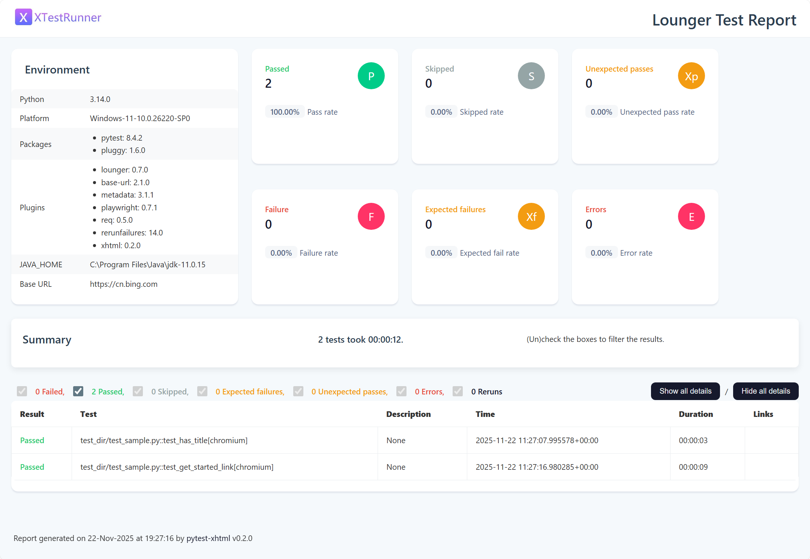
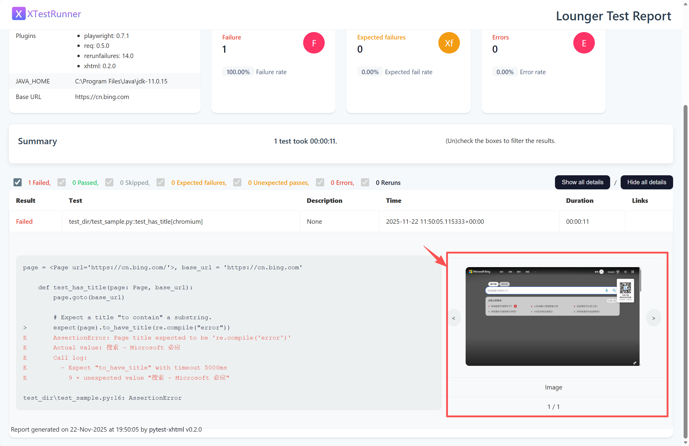

# lounger框架基于playwright进行web测试

## 安装与使用

### 安装

* 支持pip安装

```shell
pip install lounger
```

* 以下浏览器至少安装一个。

```shell
$ playwright install chromium[可选]
$ playwright install firefox[可选]
$ playwright install webkit[可选]
```

### 脚手架

lounger 支持命令生成API测试项目。

```shell
lounger --project-web myweb

2025-11-18 00:05:00 | INFO     | cli.py | Start to create new test project: myweb
2025-11-18 00:05:00 | INFO     | cli.py | CWD: D:\github\seldomQA\lounger

2025-11-18 00:05:00 | INFO     | cli.py | 📁 created folder: reports
2025-11-18 00:05:00 | INFO     | cli.py | 📄 created file: conftest.py
2025-11-18 00:05:00 | INFO     | cli.py | 📄 created file: pytest.ini
2025-11-18 00:05:00 | INFO     | cli.py | 📄 created file: test_dir/__init__.py
2025-11-18 00:05:00 | INFO     | cli.py | 📄 created file: test_dir/test_sample.py
2025-11-18 00:05:00 | INFO     | cli.py | 🎉 Project 'myweb' created successfully.
2025-11-18 00:05:00 | INFO     | cli.py | 👉 Go to the project folder and run 'pytest' to start testing.
```

* 目录结构如下

```shell
├─test_dir
│  ├─test_sample.py
├─reports
├─conftest.py
└─pytest.ini
```

### 运行测试

* 进入项目，运行测试。

```shell
cd myweb
pytest
```

* 测试报告
  

## 编写Web测试

__lounger框架对于Playwright的API百分之百兼容。__ 请阅读Playwright官方文档：

Playwright doc: https://playwright.dev/python/docs/writing-tests

lounger仅仅在周半生态上进行了增强，你只需要关注业务逻辑的编写即可。

### 运行配置

在 `pytest.ini` 配置文件中。

```ini
[pytest]
base_url = https://cn.bing.com
addopts = --browser=chromium --headed --html=./reports/result.html
```

* `base_url`: 指定测试基础的URL地址。
* `addopts`: 运行参数。
    * `--browser`: 指定运行时候的浏览器。
    * `--headed`: 指定浏览器有头模式。
    * `--html`: 指定测试报告生成的目录。

其他参数：

* 失败重跑
  ```ini
  addopts = --browser=chromium --reruns 3 --reruns-delay 1 --html=./reports/result.html
  ```
    * `--reruns`: 重跑次数。
    * `--reruns-delay`： 间隔时间（秒）

* 并发执行
  ```ini
  addopts = --browser=chromium -n auto --html=./reports/result.html
  ```
    * `-n`: 指定进程的数量，如果使用`auto` 将会根据CPU所拥有的物理核心数自动分配进程。

### 测试报告名称

在 `conftest.py` 文件中进行修改。

```python

def pytest_xhtml_report_title(report):
    report.title = "Lounger Test Report"
```

### 失败自动截图

pytest的失败截图可以通过 `conftest.py` 配置，新手往往配置起来麻烦，也不太理解配置代码的含义，lounger框架完全不用关心整个逻辑。

* 示例

```python
import re

from playwright.sync_api import Page, expect


def test_has_title(page: Page, base_url):
    page.goto(base_url)

    # Expect a title "to contain" a substring.
    expect(page).to_have_title(re.compile("error"))
```

* 失败用例截图
  

### page object模式

Playwright支持Page object模式。

https://playwright.dev/python/docs/pom

lounger框架提供了一种更简单的方式（参考 poium库的实现）。

* 示例

```python
import re

from playwright.sync_api import expect, Page

from lounger.po import BasePage, Locator


# page
class BingPage(BasePage):
    search_input = Locator('id=sb_form_q', describe="bing搜索框")
    search_icon = Locator('id=search_icon', describe="bing搜索按钮")


def test_bing_search(page: Page):
    # 进入指定URL
    page.goto("https://cn.bing.com")

    bp = BingPage(page)
    # 获得元素
    bp.search_input.highlight()
    bp.search_input.fill("playwright")
    bp.search_icon.highlight()
    bp.search_icon.screenshot(path="./docs/abc.png")
    bp.search_icon.click()

    # 断言URL
    expect(page).to_have_title(re.compile("playwright"))
```

通过`BingPage()`集中管理页面元素，通过`Locator()`定义每个元素，更加的简洁。
