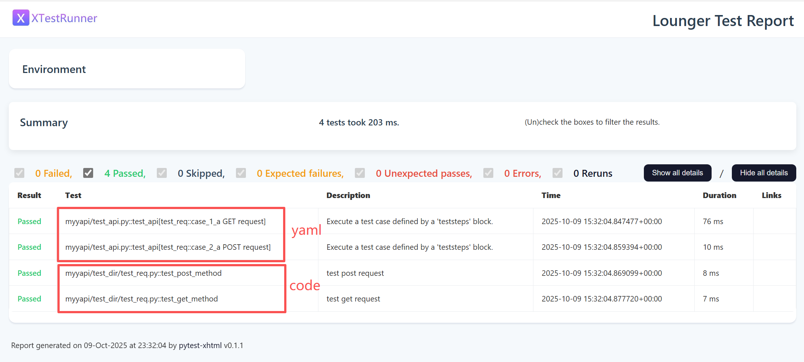

# lounger框架兼容YAPI管理API测试

## 前言

### 为什么要支持YAML管理API测试用例？

我曾经多次发表看法，对于用`YAML/JSON`文件管理API测试用例嗤之以鼻，因为`requests`、`httpx`等库已经足够简洁，而且上限很高，你可以在此基础上无限扩展它的能力。

那些鼓吹通过`YAML/JSON`可以不写代码的框架，真的可以一行代码不写吗？稍微复杂一点的功能依然离不开代码，哪怕是`postman`/`apifox`等接口测试工具，不也依然支持写代码？既然都要写代码了，为何还要扭扭捏捏，遮遮掩掩，不如直接拥抱编程。

那么，我为什么要在lounger框架中支持这种方案？

1. 最近想明白了一个道理，存在即合理，一定有一部分测试工程师真的不太懂代码，从`YAML`文件开始接触接口自动化也未尝不可。
2. 深入的研究一下，实现一个YAML测试文件的解释器的难度有多大。
3. 想实现一个两者兼得的框架，同时支持YAML文件和code两种形式的测试。

### 有哪些成熟的方案？

基于 pytest + YAML/JSON 的接口自动化测试项目：

* https://github.com/taverntesting/tavern
* https://github.com/httprunner/httprunner.py
* https://github.com/svanoort/pyresttest
* https://github.com/cdent/gabbi
* https://gitee.com/yu_xiao_qi/pytest-auto-api2

在造之前，我先调研了一些现有的方案。

首先，`pytest-auto-api2`的设计非常Low，倒不是说功能不够强大，而是将框架代码和项目代码混杂到一起，连个版本管理都没有，就那么一大坨提供给用户，真不知道目标用户的懂代码的还是不懂代码的测试工程师。

然后，`httprunner.py`的设计最为优雅，主要是 `YAML/JSON` 的定义看上去既规范又齐全，所以在用例定义上我主要参考了它的API定义规范，但并没有直接参考它的实现源码。httprunner提供了一个命令行工具`hrp run xx.yaml`就是不懂不同代码的用户。

我的目标，肯定不是第一种，但也不是第二种，希望初期的小白用户使用YAML编写API测试用例，可以过渡到通过代码编写用例，或者，简单的用例使用YAML编写，复杂的用例通过代码编写，反正，都是交给`pytest`框架运行。当然，这并不代表，我会把YAML形式的测试用例设计的非常弱鸡。

### 要实现哪些功能？

在设计之初，首先思考应该提供哪些功能。除了最基础的发送一个`GET`、`POST`请求、断言参数外，还应该支持：

1. 支持场景测试，即一个测试用例会包含多个接口的调用。
2. 支持变量的传递，即A接口的出参，可以作为B接口的入参。
3. 支持公共模块，即A和B用例都会调用到登录接口，那么登录接口应该是一个公共模块，不应该重复定义。一次定义，到处引用。
4. 支持自定义函数，实现一些复杂的计算功能，例如日期、加密，可以通过函数完成。

如果可以完成上述功能，那么应该可以解决90%的接口自动化问题了。

## 编写YAML格式API测试

首先，直接通过pip命令安装lounger框架。

```shell
pip install lounger
```

### 通过脚手架快速创建测试项目

* 通过命令创建

```shell
$ lounger -ya myyapi

2025-10-06 09:35:21 | INFO     | cli.py | Start to create new test project: myyapi
2025-10-06 09:35:21 | INFO     | cli.py | CWD: D:\github\seldomQA\lounger

2025-10-06 09:35:21 | INFO     | cli.py | 📁 created folder: reports
2025-10-06 09:35:21 | INFO     | cli.py | 📄 created file: conftest.py
2025-10-06 09:35:21 | INFO     | cli.py | 📄 created file: test_api.py
2025-10-06 09:35:21 | INFO     | cli.py | 📄 created file: config/config.yaml
2025-10-06 09:35:21 | INFO     | cli.py | 📄 created file: datas/setup/login.yaml
2025-10-06 09:35:21 | INFO     | cli.py | 📄 created file: datas/sample/test_case.yaml
2025-10-06 09:35:21 | INFO     | cli.py | 📄 created file: datas/sample/test_req.yaml
2025-10-06 09:35:21 | INFO     | cli.py | 🎉 Project 'myyapi' created successfully.
2025-10-06 09:35:21 | INFO     | cli.py | 👉 Go to the project folder and run 'pytest' to start testing.
```

* 目录结构

```shell
├─config
│  ├─config.yaml # 运行项目配置文件
├─datas
│  ├─sample  # 测试目录
│  │   ├─test_case.yaml  # 测试用例
│  │   ├─test_req.yaml   # 测试用例
│  └─setup
│  │   ├─login.yaml  # 测试用例
├─reports
├─conftest.py # pytest运行配置文件
└─test_api.py # 运行测试主文件
```

### 项目基本配置

#### 全局配置文件

* 配置项目文件: `config/config.yaml`

```shell
# 基础URL
base_url: http://127.0.0.1:5000

# 指定测试目录
test_project:
  sample: True  # /datas/sample/
  setup:        # datas/setup/

# 配置全局变量
global_test_config:
  username: admin
  password: a123456
```

参数说明：

* `base_url`: API的基础URL配置。
* `test_project`: 配置运行的目录，对应`datas`下面的测试目录，设置为`True`表示目录下的文件需要运行。
* `global_test_config`: 配置全局会用的一些变量。

#### 测试用例基本格式

* 编写简单的测试用例: `datas/sample/test_req.yaml`

```shell
- teststeps:
    - name: a GET request
      request:
        method: GET
        url: /search/
        headers:
        params:
          q: "selenium"
      validate:
        equal:
          - [ "status_code", 200 ]
- teststeps:
    - name: a POST request
      request:
        method: POST
        url: /login
        headers:
        data:
          username: "admin"
          password: "a123456"
      validate:
        equal:
          - [ "status_code", 200 ]
```

参数说明：

* teststeps：定义测试用例，一个测试用例允许包含多个测试步骤（即多个接口调用）。
* request: 设置HTTP请求，完全遵循requests库的`request()`方法参数命名。
* validate: 定义接口返回值断言。

#### 主运行文件

> 既然要实现YAML管理测试用例，为什么还要提供这么个代码文件，其实所谓无代码，只是利用了pytest的参数化，测试用例通过YAML数据文件描述，最终交给 `@pytest.mark.parametrize()` 解析，然后，交由pytest运行， 在pytest看来，这就是一个使用参数化的测试用例。此外，这里相当于留了个口子，如果不懂代码，只运行这个文件就完了，如果有兴趣一探究竟，可以研究`@load_teststeps()`装饰器是如何识别和加载用例的，`execute_case()`又是如何执行用例的。

* 主要运行文件：`test_api.py`

```python
# test_api.py
from typing import List, Dict

from lounger.case import execute_case
from lounger.log import log
from lounger.yaml_cases import load_teststeps


@load_teststeps()
def test_api(test_name: str, teststeps: List[Dict], file_path: str):
    """
    Execute a test case defined by a 'teststeps' block.
    """
    log.info(f"✅ Starting test case: {test_name}")
    log.info(f"📁 Source file: {file_path}")
    log.info(f"🔧 Contains {len(teststeps)} step(s)")

    for i, step in enumerate(teststeps):
        step_name = step.get("name", f"step_{i + 1}")
        log.info(f"🔹 Executing step {i + 1}/{len(teststeps)}: {step_name}")
        execute_case(step)
```

### 运行测试

最后，就是运行测试用例，就是使用 `pytest` 命令，所以100%兼容pytest的参数。

```shell
pytest -vs test_api.py

collecting ... 2025-10-08 01:21:08 | INFO     | run_config.py | project_name_list: ['sample', 'setup']
2025-10-08 01:21:08 | INFO     | run_config.py | === Read Test Configuration ===
2025-10-08 01:21:08 | INFO     | run_config.py | Running tests: ['sample']
2025-10-08 01:21:08 | INFO     | run_config.py | Skipped tests: ['setup']
2025-10-08 01:21:08 | INFO     | run_config.py | project_name_list: ['sample', 'setup']
2025-10-08 01:21:08 | INFO     | yaml_cases.py | ✅ Successfully loaded 2 test case(s)
collected 2 items                                                                                                          

test_api.py::test_api[test_req::case_1_a GET request] 2025-10-08 01:21:08 | INFO | ✅ Starting test case: test_req::case_1_a GET request
2025-10-08 01:21:08 | INFO | 📁 Source file: D:\github\seldomQA\lounger\myyapi\datas\sample\test_req.yaml
2025-10-08 01:21:08 | INFO | 🔧 Contains 1 step(s)
2025-10-08 01:21:08 | INFO | 🔹 Executing step 1/1: a GET request
2025-10-08 01:21:08 | INFO | Executing test step: a GET request
2025-10-08 01:21:08 | INFO | -------------- Request -----------------[🚀]
2025-10-08 01:21:08 | INFO | [method]: GET      [url]: /search/ 
2025-10-08 01:21:08 | DEBUG | [params]:
{
  "q": "selenium"
}
2025-10-08 01:21:08 | INFO | -------------- Response ----------------[🛬️]
2025-10-08 01:21:08 | INFO | successful with status 200
2025-10-08 01:21:08 | DEBUG | [type]: json      [time]: 0.003929
2025-10-08 01:21:08 | DEBUG | [response]:
 {
  "code": 10200,
  "data": [
    "selenium教程",
    "seleniumhq.org",
    "selenium环境安装"
  ],
  "message": "success"
}
2025-10-08 01:21:08 | WARNING | API association variable extraction not set
2025-10-08 01:21:08 | INFO | [equal] assertion passed: expr=status_code, expected=200, actual=200
PASSED
test_api.py::test_api[test_req::case_2_a POST request] 2025-10-08 01:21:08 | INFO | ✅ Starting test case: test_req::case_2_a POST request
2025-10-08 01:21:08 | INFO | 📁 Source file: D:\github\seldomQA\lounger\myyapi\datas\sample\test_req.yaml
2025-10-08 01:21:08 | INFO | 🔧 Contains 1 step(s)
2025-10-08 01:21:08 | INFO | 🔹 Executing step 1/1: a POST request
2025-10-08 01:21:08 | INFO | Executing test step: a POST request
2025-10-08 01:21:08 | INFO | -------------- Request -----------------[🚀]
2025-10-08 01:21:08 | INFO | [method]: POST      [url]: /login 
2025-10-08 01:21:08 | DEBUG | [data]:
{
  "username": "admin",
  "password": "a123456"
}
2025-10-08 01:21:08 | INFO | -------------- Response ----------------[🛬️]
2025-10-08 01:21:08 | INFO | successful with status 200
2025-10-08 01:21:08 | DEBUG | [type]: json      [time]: 0.006247
2025-10-08 01:21:08 | DEBUG | [response]:
 {
  "code": 10200,
  "data": {
    "token": "token123456"
  },
  "message": "login success"
}
2025-10-08 01:21:08 | WARNING | API association variable extraction not set
2025-10-08 01:21:08 | INFO | [equal] assertion passed: expr=status_code, expected=200, actual=200
PASSED

==================================================== 2 passed in 0.15s ====================================================
```

## 核心功能

### 场景测试&变量传递

在场景测试中，我们往往需要将A接口的返回值提取出来，作为B接口的参数。

```yaml
- teststeps:
    - name: step one
      request:
        method: GET
        url: /id/1
      extract:
        user_name: "data.name" # 提取接口返回数据，保存为变量user_name
        user_age: "data.age" # 提取接口返回数据，保存为变量user_age
      validate:
        equal:
          - [ "status_code", 200 ]
    - name: step two
      request:
        method: POST
        url: /add_user
        headers:
          Content-Type: application/json
        json:
          age: ${extract(user_age)}  # 将user_age变量用作接口入参
          name: ${extract(user_name)} # 将user_name变量用作接口入参
          height: 173
      extract:
        resp_code: "code"
        resp_age: "data.age"
      validate:
        equal:
          - [ "status_code", 200 ]
```

### 支持全局变量配置

首先，在`config/config.yaml`文件中配置全局变量。

```yaml
# config/config.yaml
...

# 全局测试变量
global_test_config:
  username: admin
  password: a123456
```

然后，在测试用例中引用全局变量。

```yaml
# datas/setup/login.yaml
- teststeps:
    - name: user login api
      request:
        method: POST
        url: /login
        headers:
        data:
          username: ${config(username)} # 读取config.yaml全局测试变量
          password: ${config(password)} # 读取config.yaml全局测试变量
      extract:
        login_token: "data.token"  # 提取保存登录变量
      validate:
        equal:
          - [ "status_code", 200 ]
```

### 支持前置步骤

在场景测试中，往往需要多个前置口的调用。例如，执行C接口，要先调用A接口和B接口。

首先，创建一个login.yaml接口调用。

```yaml
# datas/setup/login.yaml
- teststeps:
    - name: user login api
      request:
        method: POST
        url: /login
        headers:
        data:
          username: ${config(username)}
          password: ${config(password)}
      extract:
        login_token: "data.token"  # 提取保存登录变量
      validate:
        equal:
          - [ "status_code", 200 ]
```

然后，在测试用例中引用`login.yaml`文件。

```yaml
- teststeps:
    - presteps:
        - setup/login.yaml # 引用 login.yaml 作为前置接口。
    - name: get user info
      request:
        method: GET
        url: /id/1
        headers:
          Content-Type: application/json
          Authorization: ${extract(login_token)}
        params:
      extract:
        user_name: "data.name"
        user_age: "data.age"
      validate:
        equal:
          - [ "status_code", 200 ]
```

注意：`presteps` 支持多个前置步骤编排。

```yaml
    - presteps:
        - setup/aa.yaml
        - setup/bb.yaml
        - setup/cc.yaml
```

### 支持自定义函数

在实际的测试过程中，一些数据需要通过一些复杂的计算生成，例如`日期`、`加密`等。

借助于`conftest.py`文件可以定义任意计算函数。

```python
# conftest.py

def age_add_one(age):
    return int(age) + int(1)
```

```yaml
- teststeps:
    - name: get user info
      request:
        method: GET
        url: /id/1
        headers:
          Content-Type: application/json
      extract:
        user_name: "data.name"
        user_age: "data.age"  # 提取 user_age 变量
      validate:
        equal:
          - [ "status_code", 200 ]
    - name: add user info
      request:
        method: POST
        url: /add_user
        headers:
          Content-Type: application/json
        json:
          age: ${age_add_one($user_age)} # 调用 age_add_one() 函数，传 user_age 变量。
          name: ${extract(user_name)}
          height: 173
      extract:
        resp_code: "code"
        resp_age: "data.age"
      validate:
        equal:
          - [ "status_code", 200 ]
```

## 编写测试用例细节

### 如何编写一个请求？

YAML定义完全遵循`requests`库的 `request()` 方法的参数，本质上也是基于这个方法去发送请求的。

requests文档：https://requests.readthedocs.io/projects/cn/zh-cn/latest/

> 学习 requests库request()方法参数

```python
# requests库 request() 方法参数说明
def request(
        method,  # 请求方法，如 'GET', 'POST' 等
        url,  # 请求地址（URL）
        params=None,  # (可选) 字典或字节流，用于添加查询参数（query string）
        data=None,  # (可选) 字典、元组列表、字节或文件对象，作为请求体发送
        headers=None,  # (可选) HTTP 请求头字典
        cookies=None,  # (可选) 字典或 CookieJar 对象，随请求发送
        files=None,  # (可选) 文件字典，用于上传文件（multipart/form-data）
        auth=None,  # (可选) 认证元组或可调用对象，用于 Basic/Digest/自定义认证
        timeout=None,  # (可选) 超时时间，单位为秒（可为浮点数或 (连接, 读取) 元组）
        allow_redirects=True,  # (可选) 是否允许重定向，默认为 True
        proxies=None,  # (可选) 代理配置字典，指定协议或主机对应的代理地址
        hooks=None,  # (可选) 钩子函数字典，如请求前后执行的回调
        stream=None,  # (可选) 是否延迟下载响应内容，默认为 False（立即下载）
        verify=None,  # (可选) 是否验证服务器 TLS 证书；True/False 或 CA 证书路径
        cert=None,  # (可选) SSL 客户端证书路径，或 ('证书文件', '密钥文件') 元组
        json=None,  # (可选) JSON 数据，作为请求体发送（自动设置 Content-Type）
):
    pass
```

对应的 YAML 的定义如下

```yaml
- teststeps:
    - name: get user info
      request:
        method: GET
        url: /id/1
        headers:
        params:
        data:
        headers:
        cookies:
        auth:
        timeout:
        allow_redirects:
        stream:
        verify:
        json:
      validate:
        equal:
          - [ "status_code", 200 ]
```

### 如何编写接口断言?

假设一个接口返回格式如下：

```json
{
  "code": 10200,
  "data": { "age": 22, "id": 1, "name": "tom" },
  "message": "success"
}
```

编写测试用例，并增加断言。

```yaml
- teststeps:
    - name: get user info
      request:
        method: GET
        url: /id/1
        headers:
          Content-Type: application/json
      validate:  # 断言
        equal:   # 断言相等
          - [ "status_code", 200 ]
          - [ "body.code", 10200 ]
        not_equal:  # 断言不相等
          - [ "body.data.name", "jack" ]
        contains:   # 断言包含
          - [ "body.message", "succ" ]
        not_contains:   # 断言不包含
          - [ "body.message", "access" ]
```

* `status_code`： 表示HTTP 响应码
* `body.xxx`: 表示从接口response中提取数据。

### 如何提取变量?

在编写用例的过程中，`extract` 需要提取变量，`validate` 断言也需要提取变量。 这里用的语法是JMESpath，为什么不用JSONpath？

**JMESpath语法更简洁，用一套统一的标准，而且工能更强大。感兴趣让AI帮你生成语法对比示例，这里就不贴例子了。**

JMESpath文档：https://jmespath.org/specification.html

## 如何兼容两种形式的用例

假设，你们团队有两波人，一波人只学会了用YAML编写用例，另一波人会用代码写用例。那么如何在一个项目中兼容两种形式。

```shell
├─config
│  ├─config.yaml
├─datas # 用YAML写用例
│  ├─sample
│  │   ├─test_req.yaml
├─test_dir # 用code写用例
│  ├─test_req.py
├─reports
├─conftest.py # pytest运行配置文件
└─test_api.py # 运行测试主文件
```

* 通过pytest命令执行

```shell
pytest --html=reports\\result.html
====================================== test session starts ======================================

test_api.py ..                                              [ 50%]
test_dir\test_req.                                          [100%]

--------Generated html report: file:///D:/github/seldomQA/lounger/myyapi/reports/result.html --------
======================================= 4 passed in 0.19s =======================================
```

* 查看测试报告



通过运行方式日志和测试报告可以看到，两者可以毫无违和感的一起执行。
